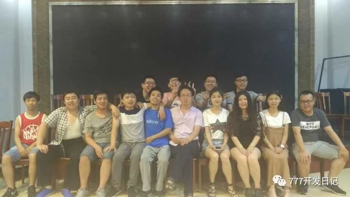

# 第三夜 十三信徒

> 雷哥的转身、付哥的刀、胖子背后的空调结成冰、宇哥的外套不御寒、

**2015年，在邯郸**

邯郸的夏天异常炎热，站在图书馆的走廊里，衣服湿了又干，干了又湿。

同学们正在屋里，吹着空调，吃着西瓜，写着代码，付哥敲了几天代码，刀功见长，已经可以将一个西瓜等分，在切西瓜中悟得了生命的真谛。

想想大多数同学现在在家里吹着空调，看着电视，在看看走廊上的自己，半干半湿的短袖，时尚的人字拖，突然觉得这个夏天更加热了。

程序已经写了半个多月了，有点想家了，整天对着电脑，眼睛酸痛，不过做的椅子还算舒服，他们都想和我换，我都拒绝了，身边的同学以为我会的很多，其实我很心虚，说自己不会，他们把我当谦虚，这样真的很累呀！

这里的办公室并不大，大家挤在一起，我的对面是导员和两个胖子，他们坐的地方刚好背风，整天喊热，不断的在空调的承受边缘试探. 努力把空调调到最低温，学姐受不了了，我也受不了，当时我坐的位置正对着空调，冷风像算计好了似的越过对面的两座大山直奔我而来.弱小的我瑟瑟发抖.

远眺学术交流中心，看着考研的学姐们马上就要下课了......

回到网络中心，叫上同学，我们也要出去吃饭了。因为现在是暑假期间，小食街只有两家卖饭的，一家卖炒饼，一家卖包子，超市也在做清仓减价，有时我们去超市买点零食。

中午有时就买碗桶面回去泡一泡，因为离宿舍很远，我们就在网络中心，伏案而休，隔壁屋是学校的机房，空调很给力，整个楼道都是冷的。

当时正逢《中国好声音》热播，闲暇时，我们就一起看，我对面坐着雷哥，经常一鸣而起，我们默默为其转身，问他，你的梦想是什么，你为什么来到这里?雷哥娓娓道来，或凄惨，或励志，或搞笑，凡所应有，无所不有。这也为我们无聊的编程带来了无限乐趣。

傍晚和导员一起去吃饭，导员说他，全邯郸的饭店他都吃过，还给我们推荐了哪家饭店的炒饼好吃。当时我们几个开车到了一家饭店，第一次来，饭店还可以，外面有停车场，附近有KTV，服务员在门口很热情，我们下车走进饭店，看着一堆菜单，我点了一份鸡蛋炒饼，不独有偶，他们也点了几份鸡蛋炒饼。coder的品味最会相同的。

晚上回到网络中心，已经没有那么热了，看着墙角的西瓜，真的吃不下去了，不要再切了，付哥。

空调结上了一层厚厚的冰，无力的吐着冷气，我穿着短裤瑟瑟发抖。两个胖子正在清理冰块，空调是他们活下去的唯一动力，无空调，毋宁死。边上肾虚的瘦子在屋里瑟瑟发抖的穿上了了冬装，即将失去活下去的勇气和尊严。两个胖子依然在喊热。

晚上下起了小雨，想想才刚8点，离回去的时间还早，继续等到10点，希望不下雨才好。这次不敢再提前走了。

想起前几天傍晚，闷雷滚滚，仿佛是恶鬼在渡劫，老天想将所有的事物化为乌有，狂风怒号，导员不知去哪里了，大家正在争论是否回宿舍，争论永远是没有结果，真正的决定不是争出来的而是行动出来的，在他们争论中，付哥，宇哥和我直接行动，下楼冒着头顶的雷鸣，骑上自动车，飞快的骑着，生怕与雨不期而至，这是第一次这么早回到宿舍，这里的宿舍是男女混住的，二楼以上是学姐们，一楼和二楼混住着学姐和男生们，每天都可以看着一群学姐。到了宿舍，刚打开空调打算平息下，这时，导员的电话打来，问我们为什么提前走了，并让我们赶紧回去，我们能怎么办，当然是屈服了，我们又赶紧骑着自行车返回去，天空还是阴沉沉的，好像在酝酿一场大雨，在回去的路上，想着如何面对导员，想了各种借口，一会，我们又回到了网络中心，导员并没有问我们为什么提前走。当一切都准备好，突然发现无处施放。

回到网络中心已经晚上10点了，导员交待了回去注意安全，然后今天的编程就结束了，我们十几个学生一起下去，学姐走在前面，事先声明：学姐都是付哥的，我们就是跟着看看。晚上一起骑车回到宿舍，路上付哥挑逗着学姐，一个胖子骑的飞快，一眨眼就看不到他了，另一个胖子慢悠悠的骑着，我和小瘦子，慢慢的骑着，走在宿舍的楼梯上，目送着学姐上楼，我们其实挺想跟上去的。

一个学姐藏在角落，不知道在干什么，付哥走了过去，我们都知道付哥又要调代码了...  付哥的代码并不是谁都能调好的，学姐就调的很好，不过调的时间很长，我们不羡慕。

早上起来，我们照常去酒店吃早茶，没想到导员已经在酒店等着我们，对就是等着我们，给我们一袋西瓜，满满的一袋。我知道今天又得解决一袋西瓜了。

时间总是过的很快，不知不觉暑假就结束了。总算不用编程了，我们还有2周的时间去浪，浪里个浪。

两周时间，我都在睡觉，看电视，体重都不见带涨的。

后来得知，我们成了关门弟子了，老师金盆洗手，不再收徒了.

**作于：2017年2月 家**

**改于：2020年12月28日**